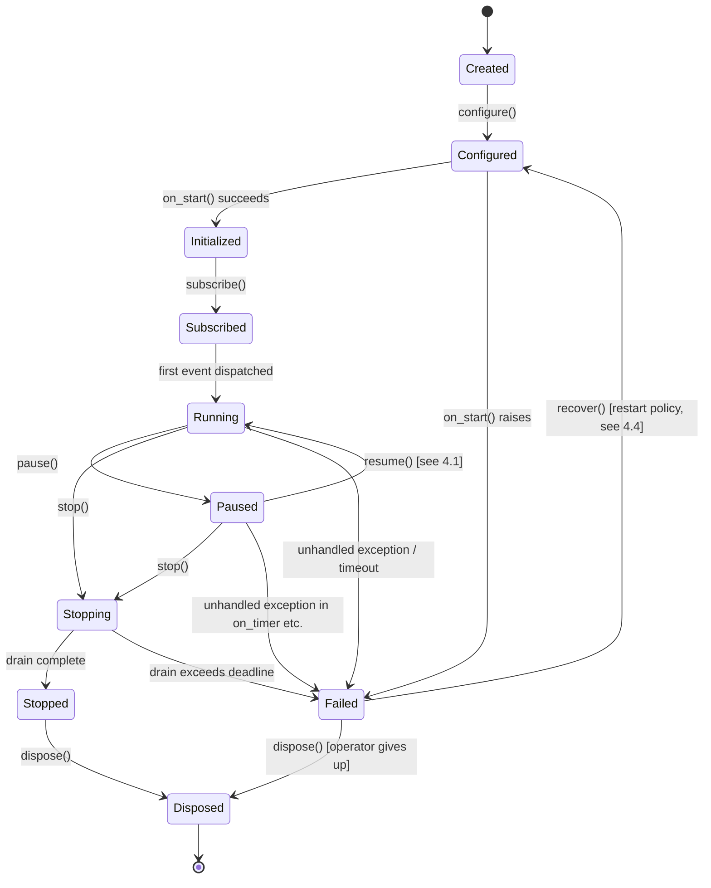

# Strategy Lifecycle — State Machine Design

**Subsystem:** Strategy Runtime
**Related:** `STRATEGY_RUNTIME_DESIGN.md`, `STRATEGY_API.md`, `STRATEGY_CONTEXT.md`

---

## 1. Design Principle

The lifecycle is modeled as an **explicit, pure state machine**:
`(StrategyState, LifecycleEvent) → StrategyState`, evaluated by the Runtime
Supervisor. It is never represented as a mutable field flipped in place
inside a strategy object. This gives three properties for free:

- **Auditability** — every transition is itself a recorded event, so "why is
  this strategy Paused" is answerable from the event log, not from tribal
  knowledge.
- **Testability** — the transition function can be unit tested exhaustively
  against every `(state, event)` pair without instantiating a real strategy
  or any infrastructure.
- **Guardability** — invalid transitions are rejected by the function
  itself, not by scattered `if` checks in caller code.

## 2. States

The brief specifies nine states. This design adds a tenth, **`Failed`**,
because "strategy throws an exception" (explicitly listed as a failure mode
to handle) cannot be represented by any of the nine given states without
overloading `Stopped` to mean two different things (clean stop vs. crash).
Overloading a terminal-looking state to mean both "intentional" and
"error" is a common source of operational confusion (alerting on `Stopped`
either pages for every planned shutdown, or silently ignores real crashes)
— splitting them removes that ambiguity for the life of the framework.

| State | Meaning |
|---|---|
| `Created` | Instance exists in memory; no config applied. |
| `Configured` | Immutable configuration bound; not yet validated against runtime resources. |
| `Initialized` | `on_start()` has run successfully; strategy has allocated any internal (non-runtime) resources it needs. |
| `Subscribed` | Event subscriptions registered with the Dispatcher; strategy will now receive events. |
| `Running` | Actively receiving and processing events. |
| `Paused` | Subscriptions suspended; strategy retains state but receives no events. |
| `Resumed` | Transient state — see §4.1. |
| `Stopping` | Graceful shutdown initiated; draining in-flight hook calls and open orders per policy. |
| `Stopped` | Cleanly stopped; no further events will be delivered; resources released. |
| `Failed` | *(added)* Unrecoverable error occurred; isolated from other strategies; awaiting operator decision or auto-recovery per policy. |
| `Disposed` | Terminal; instance eligible for garbage collection; no transitions out. |

## 3. State Diagram

## 4. Transition Semantics

### 4.1 Why `Resumed` is transient, not a resting state
The brief lists `Resumed` as a distinct state between `Paused` and
`Running`. Treating it as a state a strategy can *sit in* is a design smell:
what does it mean for the runtime to be "in Resumed" for an extended
period, as opposed to already back in `Running`? Two options were
considered:

| Option | Description | Verdict |
|---|---|---|
| A | `Resumed` is a persistent state, engine stays there until something else moves it | Rejected — ambiguous with `Running`; nothing meaningfully different happens while "resumed" vs "running" |
| B | `Resumed` is the *transition itself* (an event/telemetry marker), not a state the machine parks in — the state machine goes `Paused → Running` and emits a `Resumed` lifecycle event for observability | **Chosen** |

**Chosen: Option B.** `Resumed` exists as a recorded event in telemetry (so
operators can see "this strategy was paused for 4 minutes then resumed at
14:02:03") but is not a state the Runtime Supervisor's transition table
treats as distinct from `Running`. This keeps the state count minimal (G8:
extensibility without complexity creep) while still satisfying the brief's
requirement that resume behavior be explicit and observable.

### 4.2 Transition Table

| From | Trigger | To | Guard | Side Effect |
|---|---|---|---|---|
| `Created` | `configure(cfg)` | `Configured` | `cfg` passes schema validation | Config frozen and attached |
| `Configured` | runtime calls `on_start(context)` | `Initialized` | none | Strategy's declared resource needs recorded |
| `Configured` | `on_start` raises | `Failed` | — | Exception captured, telemetry emitted, isolated |
| `Initialized` | Runtime Supervisor calls `subscribe()` | `Subscribed` | subscription set derived from strategy declaration is non-empty or explicitly declared empty (timer-only strategies) | Dispatcher's Subscription Index updated |
| `Subscribed` | first event delivered | `Running` | — | — |
| `Running` | `pause()` (operator or scheduled maintenance window) | `Paused` | no in-flight hook call for this strategy | Subscriptions marked inactive; Dispatcher skips this strategy |
| `Paused` | `resume()` | `Running` | Context/Portfolio/Risk views are refreshed before delivery resumes (see §4.3) | Subscriptions reactivated; `Resumed` telemetry event emitted |
| `Running` / `Paused` | `stop()` (operator or shutdown) | `Stopping` | — | Dispatcher stops delivering new events; strategy's `on_shutdown()` invoked with a deadline |
| `Running` / `Paused` | unhandled exception, hook timeout, or repeated malformed output | `Failed` | — | Exception + last-N-events context captured; strategy isolated (G2); other strategies unaffected |
| `Stopping` | drain complete (no in-flight hooks, `on_shutdown` returned) within deadline | `Stopped` | — | Resources released; final telemetry snapshot recorded |
| `Stopping` | drain exceeds deadline | `Failed` | — | Forced termination; flagged distinctly from a clean crash so operators can distinguish "wouldn't stop" from "crashed" |
| `Stopped` | `dispose()` | `Disposed` | — | Instance references released |
| `Failed` | `recover()` per restart policy | `Configured` | backoff window elapsed, retry budget not exhausted (§4.4) | State either rehydrated from event log (warm) or reset (cold), per policy |
| `Failed` | operator gives up / retry budget exhausted | `Disposed` | — | — |

### 4.3 Refresh-on-resume
When a strategy transitions `Paused → Running`, the Context Factory does
**not** hand it the Context that existed at the moment of pausing. It builds
a fresh `Context` reflecting current Portfolio/Risk/Market state. Rationale:
a strategy paused for an hour must not wake up believing it is still
operating in a stale world — that is a direct path to the kind of
"strategy trades on data from an hour ago" bug that immutability elsewhere
in AlphaLab is specifically designed to prevent. The strategy's *internal*
state (whatever it privately tracks) is untouched by the runtime — only the
runtime-supplied Context is refreshed.

### 4.4 Restart / Recovery Policy
`Failed → Configured` is gated by a **restart policy**, not automatic by
default. Three policies are supported, chosen per-strategy at configuration
time:

- **`none`** — never auto-restart; `Failed` strategies sit until an operator
  calls `recover()` or `dispose()` explicitly. Recommended default for
  strategies trading real capital.
- **`bounded-retry`** — auto-restart with exponential backoff, up to N
  attempts within a rolling window; exceeding the budget forces `Disposed`
  and pages an operator. Recommended for market-data-hiccup-sensitive
  strategies where transient disconnects are the dominant failure mode.
- **`always`** — unconditional immediate restart. **Not recommended** for
  live trading; documented here mainly to explicitly discourage it — an
  always-restart policy on a strategy with a logic bug produces a crash
  loop that can itself become a source of duplicate/erroneous orders if not
  paired with idempotent order-intent handling downstream (see
  `STRATEGY_RUNTIME_ADVANCED_TOPICS.md` §Failure Recovery for the fuller
  discussion of why crash-loop + non-idempotent intents is dangerous).

### 4.5 Cold vs. Warm Restart
- **Cold restart:** strategy re-enters `Configured` with a brand-new
  instance; no memory of prior internal state. Simple, safe, but loses any
  in-memory indicator/window state the strategy had accumulated.
- **Warm restart:** strategy re-enters `Configured`, but its internal state
  is rehydrated by **replaying the event log** from its last known-good
  checkpoint (not by serializing/restoring arbitrary Python object state,
  which is fragile across code versions). This is the same event-sourcing
  mechanism backtesting uses (`STRATEGY_RUNTIME_ADVANCED_TOPICS.md`
  §Backtesting), which is a deliberate reuse — the runtime does not
  maintain two separate replay mechanisms for "recovery" and "backtest."
- **Recommendation:** warm restart via replay is the target end-state; cold
  restart is the acceptable fallback for strategies that declare themselves
  stateless (pure functions of the current Context) — a declaration
  strategies make explicitly in configuration, not something the runtime
  infers.

## 5. Invalid Transitions

Any transition not present in the table in §4.2 is rejected by the pure
transition function, which returns an explicit `InvalidTransition(from,
attempted_event)` result rather than raising — this keeps the state machine
itself total and side-effect-free, consistent with the "pure functional
state transitions" principle already in use elsewhere in AlphaLab. The
Runtime Supervisor is responsible for turning an `InvalidTransition` result
into an operator-visible error (e.g., attempting to `pause()` a `Disposed`
strategy) without ever crashing the runtime process itself.

Examples of invalid transitions explicitly rejected:
- `Disposed → *` (terminal, no transitions out)
- `Created → Running` (must pass through `Configured`, `Initialized`,
  `Subscribed`)
- `Stopped → Running` (must go through `Configured` again via `recover()`,
  even though `Stopped` was a clean, non-error exit — this is intentional:
  re-entering `Running` from `Stopped` without re-configuration would allow
  a strategy to silently resume with a config that may have since changed
  underneath it)

## 6. Recovery and Restart — Cross-Reference

Full failure-mode-by-failure-mode recovery behavior (market disconnect,
Risk rejection, OMS rejection, partial fill, broker unavailable, clock
stops) is specified in `STRATEGY_RUNTIME_ADVANCED_TOPICS.md` §Failure
Recovery, since several of those failures do **not** necessarily drive a
strategy into `Failed` at all (e.g., a Risk rejection is routed to
`on_order` as ordinary feedback, not treated as a lifecycle event) — the
lifecycle document here defines the state machine; the advanced-topics
document defines which real-world failures map to which lifecycle
transitions.
