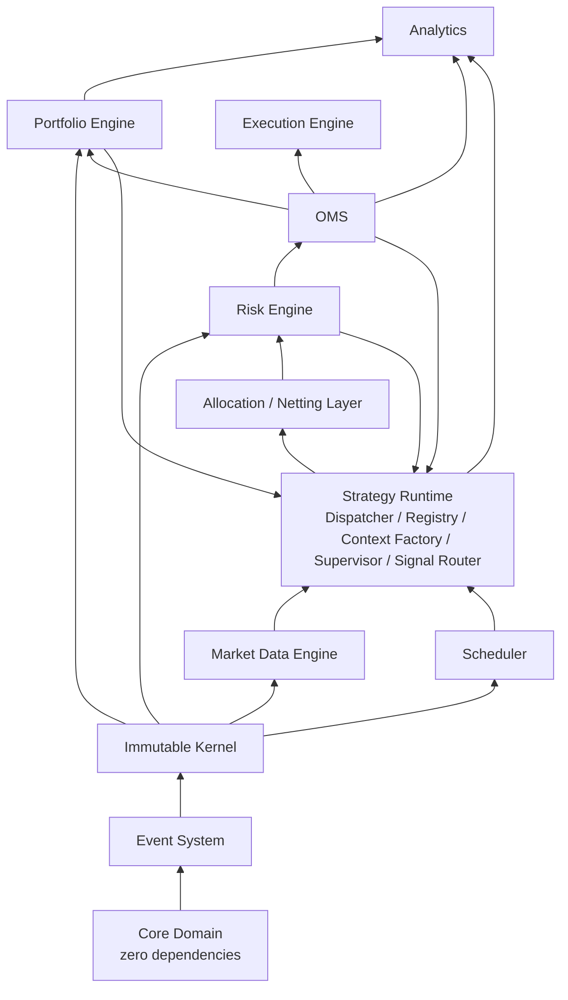
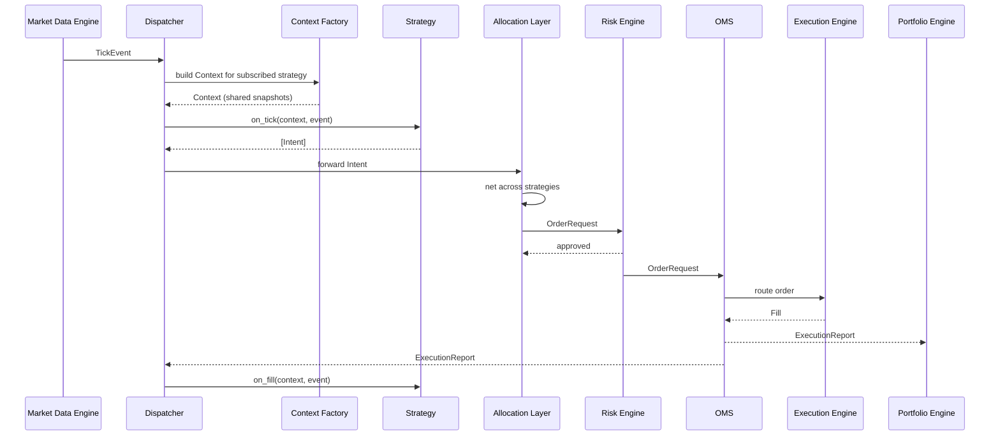
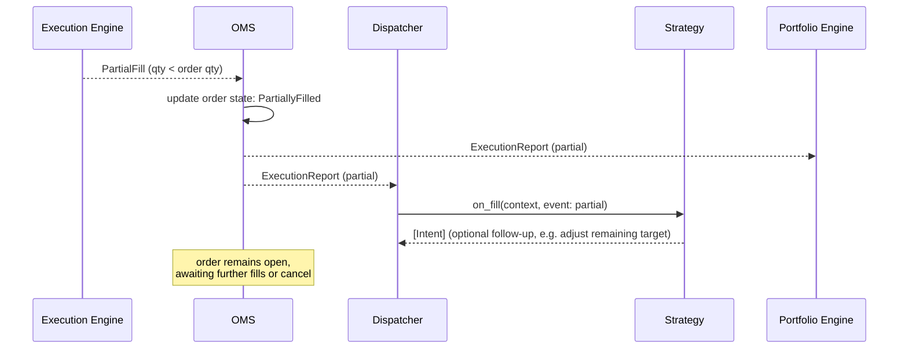
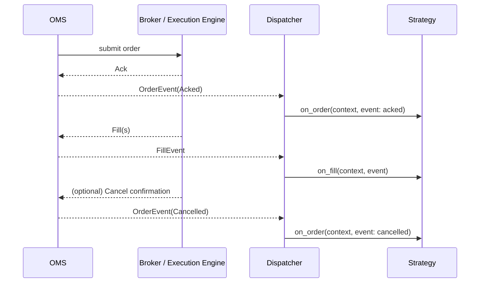
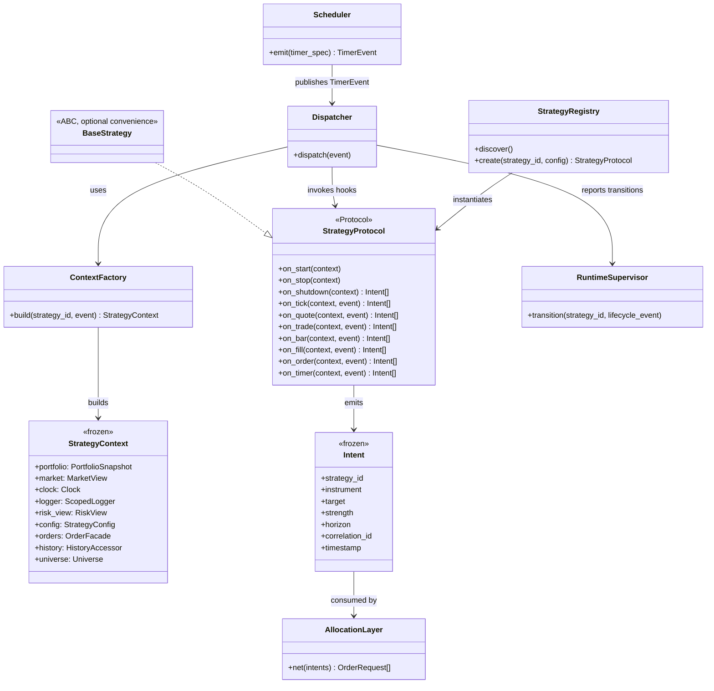

# Strategy Runtime — Advanced Topics

**Subsystem:** Strategy Runtime
**Related:** `STRATEGY_RUNTIME_DESIGN.md`, `STRATEGY_LIFECYCLE.md`, `STRATEGY_API.md`, `STRATEGY_CONTEXT.md`, `SIGNAL_MODEL.md`

> Covers: multi-strategy support, scheduler, plugin system, state machine
> internals, complete dependency graph, failure recovery, performance,
> threading model, backtesting integration, live trading integration,
> sequence diagrams, class diagrams, and a design-decision log.

---

## 1. Multi-Strategy Support (1000+ concurrent strategies)

### 1.1 Capital Allocation

Three allocation architectures were evaluated:

| Architecture | Description | Pros | Cons |
|---|---|---|---|
| **Fixed capital allocation** | Each strategy is assigned a fixed capital budget at configuration time; `Intent.target` (a weight) is interpreted against that fixed budget. | Simple, predictable, easy to reason about risk per strategy | Doesn't adapt to strategy performance; a strategy that's been performing well gets no more capital than a mediocre one; capital can sit idle if some strategies are flat |
| **Risk-parity allocation** | Capital assigned inversely proportional to each strategy's realized/estimated volatility, rebalanced periodically | Better risk-adjusted use of capital across heterogeneous strategy types (a low-vol stat-arb strategy and a high-vol momentum strategy shouldn't get equal dollar risk) | More moving parts; requires a reliable rolling volatility estimate per strategy, which is itself a research problem, not a pure infra problem |
| **Dynamic, performance-based (Kelly-adjacent) allocation** | Capital reallocated based on realized strategy performance (e.g., a fractional-Kelly or similar sizing rule updated periodically) | Best long-run capital efficiency in principle | Highest complexity; risk of pro-cyclical overallocation to recently-lucky strategies if not carefully dampened; hardest to explain/audit |

**Recommendation:** ship **fixed capital allocation** as the default, safe,
auditable v1 mechanism, with the Allocation Layer designed as a pluggable
component (§1.3-style separation) so risk-parity or performance-based
allocation can be added later as an alternative allocation policy without
touching the runtime itself. This mirrors the framework-wide principle
(`STRATEGY_RUNTIME_DESIGN.md` §1.1) of shipping a narrow, safe default and
extending outward rather than shipping maximal complexity up front.

### 1.2 Capital Sharing

Portfolio maintains one aggregate ledger plus **per-strategy sub-ledgers**
(flagged as a likely required Portfolio Engine enhancement in
`STRATEGY_RUNTIME_DESIGN.md` §10). Each sub-ledger tracks that strategy's
attributed positions/cash *for accounting and limit purposes*, while the
Execution Engine may net orders at the instrument level across strategies
before routing to market (so two strategies wanting opposite positions in
the same name don't literally cross each other's orders through a broker,
paying the spread twice). Netting-for-execution and sub-ledger-accounting
are deliberately kept as separate concerns — the sub-ledger is what
strategies see in their `Context.portfolio` (`STRATEGY_CONTEXT.md` §2);
the netted market-facing order is an OMS/Execution concern strategies never
see directly.

### 1.3 Priority and Conflict Resolution

A **conflict** is defined as two or more strategies emitting `Intent`s
implying opposing directional exposure on the same instrument within the
same allocation cycle. Resolution options:

| Option | Description |
|---|---|
| Priority ordering | Strategies are ranked (by configuration, e.g., a "core" book beats a "satellite" book); higher-priority Intent wins, lower-priority Intent for the same instrument is scaled down or dropped |
| Pure netting | All Intents for an instrument are summed (weighted by allocated capital and confidence) into one net target; no strategy "wins," the net outcome reflects the combination |
| Configurable per-instrument policy | Some instruments (e.g., core index hedges) use priority; others (e.g., a stat-arb basket where offsetting views across strategies are expected and fine) use netting |

**Recommendation:** pure netting as the default (most consistent with
choosing `Intent` as the emitted type in `SIGNAL_MODEL.md` — netting is
precisely what makes `Intent` a better fit than `OrderRequest` for
multi-strategy use), with priority ordering available as an explicit
per-instrument or per-strategy-group override for cases (e.g., a designated
hedging strategy) where netting away its effect would be actively wrong.

### 1.4 Signal Aggregation

When multiple strategies emit `Intent`s for the same instrument in the same
cycle, the Allocation Layer aggregates via a capital- and
confidence-weighted sum of target exposures (each strategy's `target`
weight, scaled by its allocated capital, scaled by its `Intent.strength`
if present) to produce one net target. This is a deterministic, auditable
function — not a black box — so that "why did we end up net long 200
shares of X" is always traceable to the specific `Intent`s and weights that
produced it (feeding directly into the audit trail Telemetry already
provides, `STRATEGY_RUNTIME_DESIGN.md` §5.7).

### 1.5 Architecture for 1000+ concurrent strategies

Three candidate architectures:

1. **Independent OMS instance per strategy, netting happens post-trade at
   the broker/prime-broker level.** Rejected — pushes a core architectural
   concern (netting) outside the framework entirely, defeats the purpose of
   building an Allocation Layer at all, and means AlphaLab itself never has
   a correct, unified view of net exposure pre-trade (a Risk Engine
   correctness problem, not just an efficiency one).
2. **Shared runtime, central Allocation/Netting Layer, single OMS.**
   **Recommended.** Matches the `Intent → OrderRequest` pipeline already
   committed to in `SIGNAL_MODEL.md`, gives Risk Engine one coherent
   pre-trade view, and is what makes §1.2's sub-ledger design coherent.
3. **Hierarchical strategy-of-strategies (a meta-strategy that itself
   consumes other strategies' Intents as its "market data" and re-emits its
   own Intent).** Interesting for specific use cases (e.g., an ensemble
   meta-strategy) but rejected as the *general* architecture for
   1000-strategy scale — it just relocates the Allocation Layer's job
   inside a strategy, which reintroduces the multi-strategy coupling
   problem `STRATEGY_CONTEXT.md` §4 explicitly rules out (a strategy seeing
   other strategies' outputs). **Supported as an opt-in pattern**: a
   meta-strategy may be configured to subscribe to a synthetic "sibling
   Intent" event *only if explicitly declared*, not by default — kept as a
   narrow, deliberate exception rather than the backbone architecture.

---

## 2. Scheduler

### 2.1 Design

The Scheduler is a **producer**, not a special caller into strategies
(`STRATEGY_RUNTIME_DESIGN.md` §5.2). It emits `TimerEvent`s onto the same
event bus the Dispatcher already consumes, so `on_timer` is dispatched
through the identical mechanism as `on_tick`/`on_bar`/etc. — no parallel
delivery path to maintain.

Supported schedule types, all normalized to the same `TimerEvent` shape at
the point of delivery (the *type* of schedule is metadata on the
subscription, not a different event class):

| Schedule type | Trigger source |
|---|---|
| Every Tick / Every Quote / Every Trade / Every Book Update | Not actually Scheduler-driven — these are direct market-event subscriptions (`on_tick`, `on_quote`, `on_trade`); listed here only to clarify they are *not* timers, despite superficially being "every X" — a common point of confusion worth documenting explicitly |
| Every Bar | Driven by Market Data Engine's bar aggregation (if it publishes bar-close events) or by the Scheduler if bars are purely time-aggregated (e.g., "every 5 minutes, aggregate and emit") — ownership boundary should be: Market Data Engine owns *aggregation*, Scheduler owns *pure time triggers* |
| Every Minute / Every Hour | Wall-clock-interval timers, but expressed against `context.clock` (virtual in backtest) so they fire correctly in both modes |
| Every Session | Calendar-aware (session open/close), requires the Scheduler to consult a trading calendar (per-exchange/instrument) — this calendar is treated as owned by Core Domain/Market Data (instrument metadata), not duplicated inside the Scheduler |
| Cron Scheduling | Standard cron-expression-driven timers, evaluated against `context.clock` |
| Calendar Scheduling | Business-day/holiday-aware scheduling (e.g., "first trading day of month"), also calendar-sourced from Core Domain |

### 2.2 Interaction with the Runtime

- Timer subscriptions are declared the same way market-data subscriptions
  are — during `on_start`/`Initialized→Subscribed` (`STRATEGY_LIFECYCLE.md`
  §2, `STRATEGY_API.md` §4).
- In backtest mode, the Scheduler is driven by the virtual Clock advancing
  as the event stream is replayed — a cron timer "fires" by the Scheduler
  inserting a `TimerEvent` into the replayed stream at the correct virtual
  timestamp, preserving deterministic ordering relative to market events
  (G1).
- In live mode, the Scheduler runs against the real monotonic Clock and
  injects `TimerEvent`s in real time.
- **Critical invariant:** the Scheduler must never let a `TimerEvent` be
  delivered out of order relative to market events at the same timestamp
  in a way that differs between backtest and live — the event bus enforces
  a deterministic tie-break rule (e.g., market events before timers at
  exactly equal timestamps) applied identically in both modes.

---

## 3. Plugin System

### 3.1 Discovery and Registration

Strategies are **not** hard-imported into runtime code
(`STRATEGY_RUNTIME_DESIGN.md` §5.3). Discovery is manifest/configuration
driven:

- Each strategy ships a small declarative **manifest** (id, `strategy-api`
  version it targets — `STRATEGY_API.md` §7 — entry point, default
  configuration schema, declared universe/subscription needs where
  statically knowable).
- The **Strategy Registry** scans a configured set of locations (installed
  packages exposing a manifest, or an explicit registry file listing
  strategy modules) at startup and builds an index of available strategy
  types — it does not import strategy *code* at this stage, only manifests,
  keeping discovery cheap and safe even with hundreds of installed strategy
  packages.

### 3.2 Factory Pattern

Instantiation goes through a **factory**, not direct construction:
`Registry.create(strategy_id, config) → StrategyProtocol instance`. This
indirection is what allows:
- Configuration-driven instantiation (a YAML/TOML strategy config
  describing which strategy id, which parameters, which capital allocation)
  without the caller needing to know the concrete class.
- Dependency injection (§3.3) to happen inside the factory, uniformly,
  rather than each strategy author wiring up their own dependencies.
- The registry to reject instantiation early (bad config, incompatible
  `strategy-api` version) before any lifecycle transition begins.

### 3.3 Dependency Injection

Strategies do not reach out and grab dependencies (a data client, a
database connection) themselves — anything they need beyond `Context` is
either (a) already in `Context`, or (b) explicitly declared in the
manifest and injected by the factory at construction time as a typed,
pre-approved dependency (e.g., a research-only historical-data client for
an `on_start` warmup routine that's heavier than the standard
`context.history` accessor supports). This keeps the static-analysis
enforcement in `STRATEGY_API.md` §3.4 meaningful — a strategy that
declares no injected network dependency and is later found importing
`requests` directly is unambiguously violating its own manifest.

### 3.4 Configuration

Strategy configuration is schema-validated (against the manifest's declared
schema) at the `Created → Configured` transition
(`STRATEGY_LIFECYCLE.md` §4.2) and frozen thereafter. Configuration is the
mechanism for capital allocation amount, universe, risk overrides, restart
policy (`STRATEGY_LIFECYCLE.md` §4.4), and schedule declarations — kept
entirely declarative/data-driven so strategy *deployment* changes never
require a code change or redeploy of the strategy package itself.

### 3.5 Hot Reload

Hot reload is supported, but **only between `Paused`/`Stopped` states, never
against a `Running` strategy.** A running strategy is mid-way through a
sequence of state-dependent decisions (its own internal indicator state,
open orders); swapping its code underneath it while `Running` is a direct
threat to G1 (determinism) — there is no meaningful way to guarantee replay
correctness across a code swap that happens at an arbitrary mid-stream
point. The supported flow is:

1. New strategy code version registered in the Registry (new manifest
   version).
2. Existing running instance is `pause()`d (`STRATEGY_LIFECYCLE.md` — a
   controlled transition, not a crash).
3. A new instance is constructed via the factory against the new code
   version, warm-restarted via event-log replay
   (`STRATEGY_LIFECYCLE.md` §4.5) to rehydrate state.
4. Old instance is `stop()`'d and `dispose()`'d only once the new instance
   is confirmed healthy and subscribed — a blue-green swap, not an in-place
   patch.

This is deliberately more ceremony than a naive "reload the module" hot
reload, and that ceremony is the point — it's what keeps hot reload
compatible with G1 and G2 rather than trading determinism for convenience.

---

## 4. State Machine — What Belongs Where

Three distinct state containers exist in the runtime; conflating them is a
common design mistake worth explicitly guarding against:

| Container | Scope | Contents | Persisted? |
|---|---|---|---|
| **RuntimeState** | Global, one instance for the whole Strategy Runtime process/shard | Registry of managed strategies and their current lifecycle state, reference to the shared Clock, reference to the capital ledger (Portfolio sub-ledger index), aggregate health/telemetry counters | Yes — this is what a Runtime Supervisor restart needs to rehydrate "which strategies were running, in what state" |
| **StrategyState** | Per-strategy | Current lifecycle state (`STRATEGY_LIFECYCLE.md` §2), subscription set, last-processed event sequence number (for warm restart replay, `STRATEGY_LIFECYCLE.md` §4.5), restart/backoff counters, and — importantly — a reference/pointer to the strategy's own private internal state (whatever the strategy author's code maintains), which the runtime treats as opaque | Yes, except the opaque internal-state pointer, which is only reconstructible via event-log replay, not directly serialized (§ rationale in `STRATEGY_LIFECYCLE.md` §4.5 — avoiding fragile object serialization across code versions) |
| **Context** | Per-hook-invocation, ephemeral | Everything enumerated in `STRATEGY_CONTEXT.md` §2 | **Never** — Context is reconstructed fresh (or reference-assembled, `STRATEGY_CONTEXT.md` §6) every time; persisting it would be both wasteful and semantically wrong, since Context represents "the world as of this instant," not a durable record |

The key discipline: **RuntimeState and StrategyState are the runtime's own
bookkeeping** (what is the system doing), while **Context is what a
strategy is shown** (what does the world look like right now). Nothing
strategy-authored should ever leak into RuntimeState/StrategyState beyond
the opaque pointer noted above, and nothing from RuntimeState/StrategyState
should be exposed verbatim through Context — Context is a deliberately
curated, narrower view (see the exclusions in `STRATEGY_CONTEXT.md` §4).

---

## 5. Complete Dependency Graph



### 5.1 Rules

1. **Core Domain has zero dependencies on anything else in this graph.**
   It is instrument identity, value types, and the frozen-dataclass
   primitives everything else builds on.
2. **Every arrow means "depends on an interface/Protocol published by,"
   never a concrete class.** This is what prevents the graph from actually
   having cycles despite the apparent feedback (e.g., OMS "depends on" the
   Strategy Runtime existing to route reports back to it — resolved via
   dependency inversion: OMS publishes `ExecutionReport` events onto the
   shared Event System bus, and the Strategy Runtime subscribes; OMS never
   imports or references the Strategy Runtime package directly). This is
   the specific technique — event-bus-mediated communication instead of
   direct calls — that resolves what would otherwise be a Runtime↔OMS
   circular import.
3. **No module below the Strategy Runtime in this graph may import
   anything from the Strategy Runtime or above.** Market Data, Portfolio,
   Risk, OMS, Execution are all strategy-agnostic — they have no idea
   strategies exist, only that they publish/consume events and read/write
   their own respective ledgers. This is what allows AlphaLab to be used
   for institutional backtesting/live trading *without* the Strategy
   Runtime at all (e.g., driving OMS directly from a research notebook) —
   an explicit extensibility property worth preserving.
4. **The Allocation/Netting Layer sits between Strategy Runtime and Risk**,
   as its own component (not folded into either), consistent with the
   architectural separation argued for in §1.5 option 2 and
   `SIGNAL_MODEL.md` §3.1.
5. **Analytics depends on everything but nothing depends on Analytics** —
   preserving the one-way door from `STRATEGY_RUNTIME_DESIGN.md` §6.7.

---

## 6. Failure Recovery

| Failure | Detection | Isolation | Recovery Action | Automatic or Operator? |
|---|---|---|---|---|
| **Strategy throws exception** | Runtime Supervisor's exception boundary around every hook call (`STRATEGY_API.md` §6) | Only the throwing strategy transitions `Running/Paused → Failed`; Dispatcher continues delivering to all others unaffected (G2) | Per configured restart policy (`STRATEGY_LIFECYCLE.md` §4.4): `none` (wait for operator), `bounded-retry` (auto, backoff, capped), or `always` (discouraged) | Configurable per-strategy |
| **Market disconnects** | Market Data Engine publishes a `MarketDisconnected` system event (owned by Market Data, forwarded onto the bus) | All strategies subscribed to the affected feed/instrument continue running but are informed via a dedicated system notification (not `Failed` — a market disconnect is not the strategy's fault and its internal state remains valid) | Strategies may optionally implement defensive logic reacting to the disconnect notification (e.g., widen internal risk checks, refuse to emit new Intents until reconnect); on reconnect, Market Data Engine is responsible for gap detection/backfill before resuming the live stream — Strategy Runtime does not attempt its own gap-filling | Automatic reconnect at the Market Data Engine layer; strategy-level reaction is author-controlled |
| **Risk rejects** | Risk Engine returns a `RiskRejection` synchronously as part of the `Intent → OrderRequest` validation step | No isolation needed — this is ordinary, expected control flow, not a failure of the runtime | Routed to the originating strategy's `on_order` hook as a structured rejection (`STRATEGY_RUNTIME_DESIGN.md` §6.3); the strategy may react (resize, retry, abandon) in its own next Intent | Not automatic at the runtime level — left to strategy logic by design, since a blanket auto-retry-on-rejection policy at the runtime level risks masking a real limit breach as a transient issue |
| **OMS rejects** | OMS returns an `OrderEvent` with a reject status | Same as Risk rejection — routed to `on_order`, not treated as a lifecycle failure | Strategy-controlled reaction, same rationale as above | Not automatic |
| **Execution partially fills** | Normal `ExecutionReport` flow (partial-fill status) | N/A — expected, routine event | Routed to `on_fill`; strategy may emit follow-up Intents (e.g., adjust remaining target) | N/A — ordinary flow, not a failure mode requiring runtime intervention |
| **Broker unavailable** | Execution Engine/OMS detects broker connectivity loss, publishes a system event | Affected strategies are **not** auto-`Failed`; open orders' state becomes explicitly "unknown/stale" (flagged via `on_order`) rather than silently assumed filled or cancelled — this distinction matters enormously for a strategy trying to reason about its true position during an outage | On reconnect, OMS performs **state reconciliation** (§8.3) against the broker's own record of open orders/positions before resuming normal event flow to strategies — this reconciliation is a hard prerequisite, not optional, given the potential for duplicate/missed fills during an outage | Automatic reconnect + reconciliation at OMS layer; strategies informed, not auto-restarted |
| **Clock stops** (e.g., a Scheduler/Clock source itself fails, in live mode) | Runtime Supervisor / RuntimeState-level heartbeat monitor (the Clock is expected to advance; a stalled Clock is itself a system-health event, not a per-strategy one) | This is treated as a **RuntimeState-level** failure, not a per-strategy one — if the Clock cannot be trusted, no strategy's decisions can be trusted for that window, so the appropriate response is a controlled, system-wide pause, not selectively failing individual strategies | Runtime enters a protective global-pause mode (all strategies `pause()`d via the ordinary lifecycle transition, not `Failed` — this was a system fault, not their fault), operator/monitoring alerted; resumes only once Clock health is restored and verified | Automatic detection and protective pause; resumption requires explicit confirmation (operator or a verified-healthy automated check), never silently auto-resumed, given the severity of trading on an untrusted clock |

### 6.1 Why crash-loop restart policy interacts dangerously with non-idempotent intents (cross-reference)

Flagged in `STRATEGY_LIFECYCLE.md` §4.4: an `always`-restart policy paired
with a strategy bug that reliably throws *after* emitting an Intent (but
before some internal bookkeeping completes) can produce a loop that
repeatedly emits similar Intents on each crash-restart cycle. This is why
`Intent.correlation_id` (`SIGNAL_MODEL.md` §4) exists — the Allocation
Layer and Risk Engine are expected to apply idempotency/duplicate-detection
using `correlation_id` plus a bounded time window, so that even a
misbehaving crash-looping strategy cannot cause unbounded duplicate order
submission. This is a defense-in-depth measure, not a substitute for
choosing `bounded-retry` or `none` as the actual policy for live-capital
strategies.

---

## 7. Performance Architecture

**Targets:** 1000 strategies, 100,000 events/sec, deterministic replay,
parallel execution, multi-core support.

Key architectural decisions in service of these targets:

1. **Reference-shared immutable snapshots, not per-invocation copies**
   (`STRATEGY_CONTEXT.md` §6.1) — the single biggest lever, since naive
   per-hook deep copying of Portfolio/Risk state is the most obvious way to
   blow the performance budget at this scale.
2. **Subscription-indexed dispatch, not broadcast** (`STRATEGY_API.md` §4)
   — routing cost is O(subscribers-to-this-event), not O(all-strategies),
   which is what makes 1000 strategies × 100k events/sec tractable at all
   (broadcast dispatch would be O(strategies × events), several orders of
   magnitude worse).
3. **Sharding strategies across cores/processes** (detailed in §8,
   Threading Model) rather than one giant shared-memory loop — each shard
   independently deterministic, aggregated at the Allocation Layer.
4. **Batching at the event-bus level**: events for the same instrument
   arriving in a tight burst are dispatched as a batch to the Context
   Factory so shared-snapshot construction (§ above) is amortized across
   the batch rather than repeated per-event.
5. **Object pooling for the genuinely per-invocation parts of Context**
   (`STRATEGY_CONTEXT.md` §6.2) to bound GC pressure.
6. **Deterministic replay is a property of the event log + seeded/derived
   randomness, not of real-time execution speed** — meaning performance
   optimizations (parallelism, batching) must preserve *logical* event
   ordering per instrument/strategy even when they change *wall-clock*
   processing order across shards. This is the constraint that makes
   "parallel execution" and "deterministic replay" compatible rather than
   contradictory: parallelism is applied across independent
   shards/strategies, never across the ordered event sequence *within* a
   single strategy's view of a single instrument.

---

## 8. Threading Model

| Model | Description | Determinism fit | Throughput fit | Complexity |
|---|---|---|---|---|
| **Single-threaded event loop** | One thread processes the entire event stream, dispatching to all strategies sequentially | Excellent — trivially deterministic | Poor at 1000-strategy/100k-events-sec scale — no parallelism at all | Lowest |
| **Multi-threaded with shared locks** | Strategies processed on a thread pool, shared state (Portfolio, Registry) protected by locks | Poor — lock contention ordering is generally not deterministic across runs unless extremely carefully controlled, and that control largely negates the throughput benefit | Good in theory, often disappointing in practice due to contention on shared structures at this event rate | High — classic concurrent-correctness burden, exactly the class of bug the rest of AlphaLab's immutable-kernel philosophy is trying to avoid |
| **Actor model** (each strategy is an isolated actor with its own mailbox) | Strategies never share memory; communicate only via message passing | Good — per-actor processing is naturally isolated and orderable | Good — scales across cores without shared-state locking | Moderate-high — requires an actor runtime/message-passing infrastructure, somewhat foreign to the rest of AlphaLab's synchronous, functional style |
| **Async/event loop (single-threaded, cooperative)** | One thread, but hooks may `await` I/O without blocking the loop | Good determinism (single logical thread of control) | Limited — cooperative concurrency still doesn't use multiple cores; fine for I/O-bound work, not for CPU-bound strategy logic (indicator computation, RL inference) | Moderate |
| **Hybrid: sharded single-threaded cores + async I/O at the edges** | Strategies are partitioned into shards (by instrument, strategy group, or hash); each shard runs a single-threaded, synchronous, deterministic event loop on its own core/process; I/O-bound edges (market data ingestion, broker communication) use async so they don't block shard processing; cross-shard aggregation (Allocation Layer) happens at a well-defined synchronization point, not continuously | **Excellent** — each shard is internally as deterministic as the pure single-threaded model; cross-shard ordering is made deterministic by design at the aggregation point (see below) | **Good** — true multi-core parallelism across shards | Moderate-high, but the complexity is concentrated in one well-understood place (shard partitioning + aggregation sync) rather than spread across every shared-state access site the way lock-based multi-threading spreads it |

### 8.1 Recommendation: Hybrid (sharded single-threaded + async edges)

This is the recommended architecture, for one overriding reason: **G1
(determinism) is non-negotiable, and lock-based shared-memory
multi-threading is fundamentally in tension with it.** The actor model is
a reasonable second choice and shares much of the hybrid model's
determinism story, but was not chosen as primary because it would require
introducing a message-passing runtime paradigm that doesn't otherwise exist
anywhere in AlphaLab's synchronous, functional-transition style — the
hybrid sharded model achieves the same isolation and parallelism
properties while keeping each shard's internals in the same
synchronous-dispatch style already used everywhere else in this design
(`STRATEGY_RUNTIME_DESIGN.md` §5), which is a meaningfully lower long-term
maintenance cost for a 10-year framework maintained by a broad contributor
base.

**Shard partitioning key:** by strategy group / instrument-universe
overlap, not a naive round-robin — two strategies trading disjoint
instrument sets have no need to synchronize with each other at all and
should be on independent shards; strategies that legitimately interact
(e.g., netting on the same instrument, §1) must be co-located on the same
shard or explicitly routed through the cross-shard Allocation
synchronization point, never left to race.

**Cross-shard synchronization point:** the Allocation/Netting Layer (§1,
§5) is the one place shard outputs (Intents) are combined — it consumes
Intents from all shards for a given aggregation cycle, in a defined,
deterministic merge order (e.g., sorted by `correlation_id`/timestamp then
strategy id as a tiebreak), so the *merge itself* is reproducible even
though the shards that produced the inputs ran in wall-clock parallel.

---

## 9. Backtesting Integration

- **Same runtime code path, different adapters** (G5): the Dispatcher,
  Context Factory, Runtime Supervisor, Signal Router, and Allocation Layer
  are byte-for-byte the same code in backtest and live. The only
  differences are at the edges: the Market Data source (historical
  event-log replay vs. live feed) and the OMS/Execution adapter (a
  fill-simulator vs. a real broker connection).
- **Event sourcing:** the entire pipeline is designed around a durable,
  ordered event log (market events, timer events, execution reports,
  lifecycle transitions, telemetry) as the source of truth. Backtesting is
  simply "replay this event log (or a synthetically generated one) through
  the same runtime with a virtual Clock instead of a live one." This is
  the same mechanism warm restart uses (`STRATEGY_LIFECYCLE.md` §4.5) —
  deliberately one replay mechanism serving both purposes, not two.
- **Deterministic replay:** given (a) the same event log, (b) the same
  strategy code/config, and (c) the same Allocation/Risk configuration, the
  backtest must produce byte-identical Intents, OrderRequests, and (via the
  fill simulator) fills, run after run. This is the acceptance criterion
  for G1 and should be a standing CI check (replay a fixed reference event
  log nightly, diff the output) once built, not just a design aspiration.
- **Fill simulation fidelity is explicitly out of scope for the Strategy
  Runtime** — it's an Execution Engine/backtesting-adapter concern
  (realistic slippage/market-impact modeling). The runtime's only
  obligation is to guarantee that *given* a set of simulated fills, the
  strategy-facing pipeline behaves identically to live.

---

## 10. Live Trading Integration

- **Synchronization:** the live OMS/broker adapter is the sole owner of
  order-state truth in live mode, exactly as in backtest (§6, OMS
  contract, `STRATEGY_RUNTIME_DESIGN.md` §6.4) — the runtime never
  maintains a parallel, independently-updated notion of order state.
- **Order acknowledgements:** every order submitted to a live broker
  transitions through an explicit `Acked` sub-state (broker has received
  and confirmed the order exists) before any fill can be attributed to it
  — this distinguishes "we sent it but don't yet know if the broker got it"
  from "the broker confirmed it," which matters directly for the reconnect
  reconciliation logic below (an un-acked order at disconnect time is
  handled differently from an acked-but-not-yet-filled one).
- **Reconnect behavior:** on reconnect after a broker/connectivity outage,
  OMS performs a **reconciliation pass** before resuming normal event
  delivery to strategies:
  1. Query the broker for its authoritative view of open orders and
     current positions.
  2. Diff against OMS's last-known local state.
  3. For any order whose fate is ambiguous (submitted but never acked,
     acked but fill status unknown), resolve against the broker's
     authoritative record — never guess.
  4. Reconstruct/emit any `ExecutionReport`s needed to bring the Portfolio
     Engine's sub-ledgers back in sync with the now-reconciled truth,
     *before* strategies receive any new events — this ordering guarantee
     (reconciliation completes before new-event delivery resumes) is what
     prevents a strategy from making a decision against stale/incorrect
     position state right after a reconnect.
  5. Only then does the Dispatcher resume normal delivery.
- **Heartbeats:** the broker adapter maintains an independent heartbeat
  separate from the trading event stream; a missed heartbeat is what
  triggers the "Broker unavailable" failure path in §6, not the absence of
  fills (absence of fills is not itself evidence of a problem — the market
  may simply be quiet).

---

## 11. Sequence Diagrams

### 11.1 Market Tick → Strategy → Risk → OMS → Execution → Portfolio (happy path)



### 11.2 Partial Fill



### 11.3 Rejected Order

```mermaid
sequenceDiagram
    participant ALLOC as Allocation Layer
    participant RISK as Risk Engine
    participant DISP as Dispatcher
    participant STRAT as Strategy

    ALLOC->>RISK: OrderRequest
    RISK->>RISK: evaluate against limits
    RISK-->>ALLOC: RiskRejection(reason)
    ALLOC-->>DISP: rejection, attributed to originating strategy_id
    DISP->>STRAT: on_order(context, event: rejected)
    Note over STRAT: strategy may resize/retry<br/>via a new Intent on next cycle;<br/>no automatic retry by runtime
```

### 11.4 Execution Report (order lifecycle)



### 11.5 Strategy Shutdown

```mermaid
sequenceDiagram
    participant SUP as Runtime Supervisor
    participant STRAT as Strategy
    participant ALLOC as Allocation Layer
    participant DISP as Dispatcher

    SUP->>STRAT: transition Running/Paused -> Stopping
    SUP->>STRAT: on_stop(context)
    Note over STRAT: internal flags flipped;<br/>no Intents may be emitted here
    SUP->>DISP: stop new event delivery to this strategy
    SUP->>STRAT: on_shutdown(context)
    STRAT-->>SUP: [Intent] (e.g., flatten positions)
    SUP->>ALLOC: forward final Intents
    Note over SUP: drain deadline enforced
    alt drain completes in time
        SUP->>STRAT: transition Stopping -> Stopped
    else deadline exceeded
        SUP->>STRAT: transition Stopping -> Failed (forced)
    end
```

---

## 12. Class Diagrams (Conceptual — No Implementation)



---

## 13. Design Decision Log

| Decision | Alternatives Considered | Pros of Chosen | Cons of Chosen | Chosen | Rationale |
|---|---|---|---|---|---|
| Emitted signal type | Signal, OrderRequest, Recommendation, ExecutionRequest, Intent | Netting-friendly, low author cognitive load, decoupled from execution mechanics | Requires a distinct Allocation Layer component | **Intent** | Best fit for multi-strategy netting and backtest/live symmetry; see `SIGNAL_MODEL.md` |
| Strategy contract shape | ABC, Protocol, Composition | Protocol = stable minimal contract; ABC = ergonomic default; Composition = handles heterogeneous strategy types | Slightly more concepts for authors to learn (Protocol + optional Base + adapters) than a single pattern | **Hybrid (Protocol + optional ABC + composition for cross-cutting/adapters)** | No single pattern serves both discoverability and long-term extensibility across signal strategies, RL agents, and market makers; see `STRATEGY_API.md` §5 |
| Threading/execution model | Single-threaded, lock-based multi-threaded, actor model, async, hybrid | True multi-core throughput without sacrificing per-shard determinism | Higher implementation complexity than naive single-threaded | **Hybrid: sharded single-threaded cores + async I/O edges** | Lock-based concurrency is fundamentally in tension with G1; actor model achieves similar properties but breaks stylistic consistency with the rest of AlphaLab; see §8 |
| Multi-strategy conflict resolution | Priority ordering, pure netting, per-instrument configurable | Netting is the natural consequence of choosing Intent as the emitted type; auditable, deterministic | Priority ordering needed as an override for designated hedges | **Netting by default, priority as explicit per-instrument override** | Consistent with the Intent model; avoids hard-coding one instrument's strategy as globally "special" | 
| Hot reload scope | Reload against Running strategies, reload only between Paused/Stopped | Simpler operationally | Breaks G1 if applied to a live-running strategy mid-stream | **Paused/Stopped only, blue-green swap via warm restart** | Determinism cannot be guaranteed across an in-place code swap mid-event-stream; see §3.5 |
| `Resumed` as a lifecycle state | Persistent state vs. transient telemetry marker | Fewer ambiguous states to reason about | Slight departure from the brief's literal nine-state list | **Transient marker, not a resting state** | `Resumed` sitting alongside `Running` as a separate persistent state has no distinguishing behavior; see `STRATEGY_LIFECYCLE.md` §4.1 |
| Explicit `Failed` state | Overload `Stopped` to also mean crashed, vs. add a distinct state | Simpler enum | Conflates two operationally very different situations (planned vs. crash), harmful for alerting/observability | **Added `Failed` as a distinct state** | Explicitly required to handle "strategy throws an exception" cleanly per the brief's own Failure Recovery section; see `STRATEGY_LIFECYCLE.md` §2 |
| Capital allocation policy (v1) | Fixed, risk-parity, performance-based/Kelly-adjacent | Simple, auditable, low operational risk | Less capital-efficient than adaptive schemes | **Fixed allocation as default, pluggable for future policies** | Ship the safe, explainable default first; extend via the same pluggable-policy discipline used elsewhere (G8) | 
