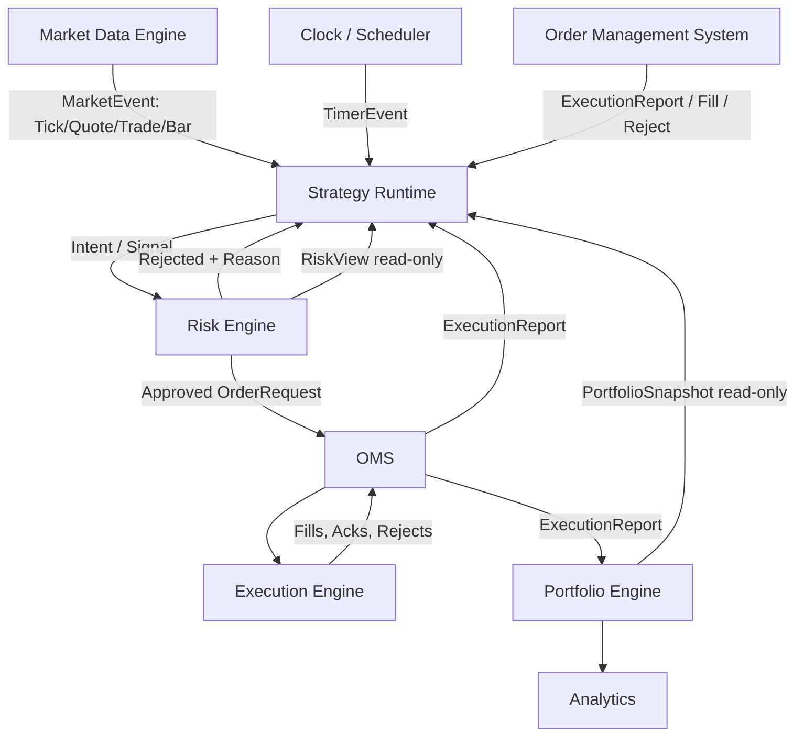
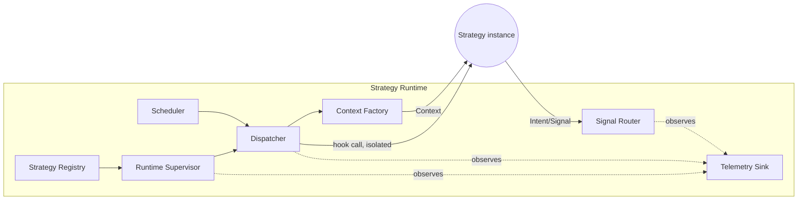
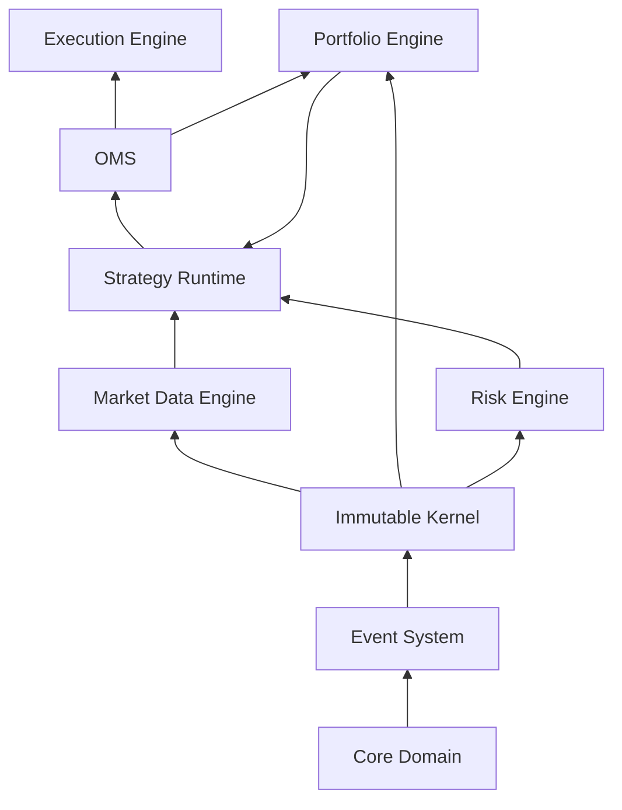

# Strategy Runtime — Architecture Design

**Subsystem:** Strategy Runtime
**Status:** Proposed (Architecture Review)
**Author:** Chief Architect
**Applies to:** AlphaLab Core, all future strategy implementations
**Audience:** Core maintainers, strategy authors, infrastructure engineers

---

## 1. Purpose and Mandate

The Strategy Runtime is the subsystem responsible for taking a piece of trading
logic — a **Strategy** — and giving it a safe, deterministic, observable place
to live inside AlphaLab. Every other engine in AlphaLab (Market Data, Risk,
OMS, Execution, Portfolio) already has a single, well-bounded job. The
Strategy Runtime's job is different in kind: it is the **substrate** that
strategies run on top of, and it is the only subsystem whose correctness is
judged not by its own logic but by how well it constrains *someone else's*
logic (the strategy author's).

This asymmetry drives every decision in this document. A bug in the Risk
Engine is a bug AlphaLab's core maintainers introduced and can reason about
exhaustively. A bug in a strategy is something a third party wrote, possibly
without reading this document carefully, possibly under time pressure, and
possibly interacting with 999 other strategies they've never heard of. The
Strategy Runtime must be **defensive by construction**, not defensive by
convention.

### 1.1 Why this is the most consequential subsystem left to design

Every existing AlphaLab module (Core Domain, Event System, Immutable Kernel,
Portfolio Engine, OMS, Execution Engine, Market Data Engine, Risk Engine) is
internal infrastructure. Its API surface is consumed by other core
maintainers who share context, coding standards, and (implicitly) trust.

The Strategy Runtime's API surface — `STRATEGY_API.md` — will be consumed by
**strategy authors**, an open-ended, growing, heterogeneous population,
possibly external contributors if AlphaLab becomes open source as intended.
Once published, this API is effectively permanent: changing method
signatures on `Strategy` after the ecosystem has 200 strategies written
against it is a breaking-change event on the scale of a major version bump.
Every other module can be refactored internally with test-suite coverage as
the safety net. This one cannot, because its "test suite" is the entire
external strategy corpus.

**Conclusion:** the runtime and API design must be conservative, minimal, and
stable — favoring a narrow surface that can be *extended* over a wide surface
that must later be *narrowed*.

---

## 2. Design Goals

| # | Goal | Rationale |
|---|------|-----------|
| G1 | **Determinism** | Identical event sequence + identical strategy code ⇒ identical decisions, in both backtest and live. This is the single non-negotiable property; see §7 and `STRATEGY_RUNTIME_ADVANCED_TOPICS.md` §Backtesting. |
| G2 | **Isolation** | One strategy's exception, slow loop, or bad state must not corrupt or stall another strategy, nor the runtime itself. |
| G3 | **Immutability at the boundary** | Everything handed *into* a strategy (Context, market events, portfolio snapshots) is immutable. Everything a strategy hands *out* (Intents/Signals) is immutable and is the only channel of effect. |
| G4 | **Testability without a broker** | A strategy must be fully unit-testable by feeding it a `Context` and a stream of events, with no live infrastructure. |
| G5 | **Symmetry between backtest and live** | The runtime code path must be identical in both modes; only the adapters at the edges (data source, execution simulator vs. real broker) differ. |
| G6 | **Horizontal scale to 1000+ strategies** | Architecture must not assume "a strategy" is a heavyweight object; must support sharding, batching, and cheap per-tick dispatch. |
| G7 | **Observability by default** | Every state transition, every emitted signal, every rejected transition must be traceable without strategy authors doing anything extra. |
| G8 | **Extensibility without core modification** | New strategy types (RL agents, market makers, stat-arb baskets) must be addable via composition/configuration, not by editing the runtime. |
| G9 | **API longevity** | The public `Strategy` surface should be stable for years; internal runtime implementation is free to evolve underneath it. |

## 3. Non-Goals

Explicitly out of scope for the Strategy Runtime itself (owned elsewhere):

- **Order routing / venue selection** — owned by Execution Engine.
- **Position sizing in absolute currency terms** — owned by a Portfolio
  Construction / Allocation layer that sits *between* the runtime and OMS
  (see `SIGNAL_MODEL.md`).
- **Risk limit enforcement** — owned by Risk Engine; the runtime only
  forwards intents, it does not second-guess Risk's verdicts.
- **Persistence of trade history** — owned by Portfolio Engine / Analytics.
- **Strategy *research* tooling** (parameter sweeps, walk-forward analysis)
  — a separate, higher-level tool that *drives* many runtime instances; not
  part of the runtime itself.

Keeping these out is itself a design decision: it keeps the runtime a thin,
fast dispatch layer instead of a monolith that duplicates Risk/OMS logic.

---

## 4. Position in the AlphaLab Pipeline

Note the two feedback edges into the Strategy Runtime: **ExecutionReport**
(fills, order acks/rejects flow back to `on_fill` / `on_order`) and
**read-only snapshots** from Portfolio and Risk that populate the next
`Context`. The runtime is deliberately positioned as a *hub*, not a
pass-through: it is the only subsystem that both consumes from upstream
(Market Data, Clock, OMS feedback) and produces for downstream (Risk), while
also being a consumer of Portfolio/Risk state for context construction.

---

## 5. Core Components of the Strategy Runtime

The Strategy Runtime is not a single class — it is a small set of
cooperating components, each independently testable.

### 5.1 Dispatcher
Consumes the unified event stream (from Market Data, Clock/Scheduler, and
OMS feedback), determines which strategies are subscribed to each event
type/instrument, and invokes the corresponding hook. Owns no strategy state
itself — it is a pure routing function: `(Event, SubscriptionIndex) →
[ (StrategyId, HookCall) ]`.

### 5.2 Scheduler
Produces synthetic `TimerEvent`s (tick-aligned, wall-clock-aligned, cron,
calendar/session-aware) and injects them into the same event stream the
Dispatcher consumes. See `STRATEGY_RUNTIME_ADVANCED_TOPICS.md` §Scheduler.
Architecturally important: the Scheduler is a *producer* on the event bus,
not a special-cased caller into strategies. This keeps the Dispatcher's
mental model uniform — everything a strategy reacts to is "an event."

### 5.3 Strategy Registry / Plugin Manager
Owns strategy discovery, registration, and instantiation via a factory
pattern. Strategies are configuration-driven (declared in a manifest), not
hard-imported into runtime code. See `STRATEGY_RUNTIME_ADVANCED_TOPICS.md`
§Plugin System.

### 5.4 Context Factory
Builds the immutable `StrategyContext` handed to each hook invocation.
Because Context construction happens on every event for every subscribed
strategy, this component is performance-critical (§9, and Performance in
`STRATEGY_RUNTIME_ADVANCED_TOPICS.md`). See `STRATEGY_CONTEXT.md`.

### 5.5 Runtime Supervisor
Owns the lifecycle state machine per strategy (`STRATEGY_LIFECYCLE.md`),
exception isolation (G2), restart/backoff policy, and health telemetry. This
is the component that turns "a strategy threw an exception" into "one
strategy transitions to `Failed`, the other 999 are unaffected."

### 5.6 Signal Router
Collects `Intent`/`Signal` objects emitted by strategies during a hook
invocation and forwards them toward the allocation/netting layer ahead of
Risk. In single-strategy deployments this is a pass-through; in multi-strategy
deployments this is where capital allocation and conflict resolution happen
(`STRATEGY_RUNTIME_ADVANCED_TOPICS.md` §Multi-Strategy).

### 5.7 Telemetry / Observability Sink
Every transition, every hook invocation (duration, exception or not), every
emitted signal, and every rejected transition is emitted as a structured
event onto an *observability* stream, separate from the trading event
stream. This is what makes G7 true without strategy authors opting in.

---

## 6. Interaction Contracts with Existing Modules

Each arrow in §4 is a **contract**, not an implementation detail. The
runtime must only ever depend on the *interfaces* below, never on concrete
classes from the modules it talks to (see Dependency Graph rules in
`STRATEGY_RUNTIME_ADVANCED_TOPICS.md`).

### 6.1 Market Data Engine → Strategy Runtime
- **Contract:** an ordered, immutable stream of `MarketEvent` (tick, quote,
  trade, book update, bar), each carrying a monotonic sequence number and a
  timestamp from the authoritative Clock (not wall-clock, so backtests and
  live share semantics).
- **Runtime obligation:** never mutate or reorder events; process in
  received order per instrument to preserve determinism.
- **Failure mode owned here:** market disconnects — see Failure Recovery.

### 6.2 Clock / Scheduler → Strategy Runtime
- **Contract:** the Clock is the single source of "now" for the entire
  system. In backtest mode it is a virtual clock driven by the event stream;
  in live mode it is synchronized to a monotonic source. The runtime never
  reads system time directly — only through the Clock exposed in Context.
- This is what makes G5 (backtest/live symmetry) achievable: strategy code
  that calls `context.clock.now()` behaves identically in both modes.

### 6.3 Risk Engine ↔ Strategy Runtime
- **Outbound contract:** the runtime forwards `Intent`/`OrderRequest`
  objects to Risk *unmodified* and *un-optimized* — the runtime does not
  attempt to pre-filter based on its own idea of what Risk will approve.
  Duplicating risk logic in two places is a correctness hazard.
- **Inbound contract:** Risk returns either an approved `OrderRequest`
  (forwarded to OMS) or a `RiskRejection` (routed back to the originating
  strategy's `on_order` hook with a structured reason code, never a bare
  exception).
- **Read-only contract:** Risk also exposes a `RiskView` (current exposure,
  remaining limit headroom, per-instrument constraints) that is folded into
  each strategy's `Context` so strategies can self-limit proactively rather
  than relying solely on post-hoc rejection.

### 6.4 OMS ↔ Strategy Runtime
- **Contract:** OMS is the sole source of truth for order state. The runtime
  never tracks order state independently — it only *reacts* to
  `ExecutionReport` events (new/ack, partial fill, fill, reject, cancel)
  that OMS publishes back onto the event stream, routed to `on_order` /
  `on_fill`.
- This avoids a classic institutional-system bug: two components each
  believing they own "the truth" about an order's state and drifting apart
  under partial fills or cancel races.

### 6.5 Execution Engine → Strategy Runtime
- **Contract:** none, directly. The runtime never talks to Execution. All
  execution feedback is mediated through OMS's `ExecutionReport` stream.
  This is intentional layering discipline — see Dependency Graph.

### 6.6 Portfolio Engine → Strategy Runtime
- **Contract:** Portfolio exposes an immutable `PortfolioSnapshot`
  (positions, cash, realized/unrealized P&L, per-strategy sub-ledger if
  multi-strategy) that the Context Factory reads to populate `Context`. The
  runtime never writes to Portfolio directly — Portfolio updates itself by
  consuming the same `ExecutionReport` stream OMS publishes.

### 6.7 Strategy Runtime → Analytics
- **Contract:** the runtime does not talk to Analytics directly. Analytics
  subscribes independently to the same event/telemetry streams (fills from
  OMS, signals from the Signal Router, lifecycle transitions from
  Telemetry). This keeps Analytics a pure *consumer*, with zero ability to
  feed back into trading decisions — an intentional one-way door that
  prevents analytics code from ever becoming a hidden dependency of live
  trading logic.

---

## 7. Event Flow Walkthrough (Narrative)

A single market tick, end to end:

1. **Market Data Engine** publishes an immutable `TickEvent` (instrument,
   price, size, exchange timestamp, sequence number) onto the event bus.
2. **Dispatcher** looks up which strategies are subscribed to this
   instrument/event type via the Subscription Index (built at
   `Subscribed` lifecycle time — see `STRATEGY_LIFECYCLE.md`).
3. For each subscribed strategy, the **Context Factory** builds (or reuses
   a pooled) immutable `StrategyContext` reflecting the state of the world
   *as of this event* — current Portfolio snapshot, current RiskView, the
   Clock, and the event itself.
4. The **Runtime Supervisor** invokes `strategy.on_tick(context, event)`
   inside an isolation boundary (timeout + exception capture). Nothing the
   strategy does can mutate `context` — it is frozen.
5. The strategy may return zero or more `Intent` objects. It does **not**
   place orders directly — see `STRATEGY_API.md` and `SIGNAL_MODEL.md` for
   why this indirection is mandatory.
6. The **Signal Router** collects intents from this dispatch cycle (and, in
   multi-strategy mode, from any other strategies reacting to the same
   event) and forwards them to the Allocation/Netting layer.
7. Allocation translates `Intent → OrderRequest`, applying capital
   allocation, position netting across strategies, and priority rules.
8. **Risk Engine** validates each `OrderRequest` against limits and either
   approves (forwarded to OMS) or rejects (routed back to the originating
   strategy).
9. **OMS** accepts the order, assigns/tracks order state, and forwards to
   **Execution Engine**.
10. Execution reports (ack, partial fill, fill, reject) flow back through
    OMS onto the event bus, routed by the Dispatcher to the originating
    strategy's `on_order` / `on_fill` hooks — closing the loop.
11. **Portfolio Engine**, subscribed independently to the same
    `ExecutionReport` stream, updates its ledger; the *next* tick's Context
    will reflect this update.
12. **Analytics**, also subscribed independently, records the fill and any
    telemetry emitted along the way.

The entire chain from step 1 to step 10 must complete deterministically
given the same inputs — this is what allows the identical code path to run
in backtest (steps 9–10 simulated) and live (steps 9–10 real) per G5.

---

## 8. Dependency Graph (Summary)

Full detail in `STRATEGY_RUNTIME_ADVANCED_TOPICS.md` §Dependency Graph.
Summary of the layering rule enforced here:

**Rule:** an arrow means "depends on the *interface* exposed by," never the
concrete implementation. The Strategy Runtime depends on Protocols/read-only
views published by Market Data, Portfolio, and Risk — it never imports their
concrete engine classes. This is what prevents the circular import that
would otherwise arise from OMS needing to report back into the runtime
while the runtime feeds OMS.

---

## 9. Architectural Principles Carried Forward

The runtime is bound by the same invariants as the rest of AlphaLab, applied
specifically to the strategy boundary:

- **Frozen dataclasses / `slots=True`** for `Context`, `Intent`,
  `MarketEvent`, and all objects crossing the strategy boundary. This is not
  merely a style preference here — it is the mechanism that makes G3
  (immutability at the boundary) enforceable rather than aspirational. A
  strategy author literally cannot mutate a frozen, slotted object; the
  interpreter enforces the invariant the architecture requires.
- **Pure functional state transitions**: the Runtime Supervisor's lifecycle
  state machine (`STRATEGY_LIFECYCLE.md`) is implemented as `(State, Event)
  → State`, not as mutation of a state field. This gives the same replay and
  audit guarantees the rest of the kernel already has.
- **Event-driven design**: every effect (an emitted Intent, a lifecycle
  transition, a telemetry record) is itself an event on a bus, not a direct
  method call with a side effect buried inside. This is what makes G7
  possible without special-casing.
- **Deterministic execution**: no hook may read wall-clock time,
  environment variables, random state, or network I/O directly. All such
  inputs are threaded through `Context` (Clock, Config) so they can be
  captured and replayed. This is enforced at the API level in
  `STRATEGY_API.md` and by convention/linting at the plugin-loading level.

---

## 10. Weaknesses to Address / Recommendations

Based on the stated current implementation, the following are recommended
verification points and risks to close out *before* the Strategy Runtime is
built on top of them. These are framed as questions because the current
modules' internals are not visible from here — each should be confirmed
against the actual code:

1. **Confirm a real Event Bus exists, not just an Event *type hierarchy*.**
   "Event System" is listed as implemented, but the runtime requires an
   actual pub/sub dispatch mechanism with ordering guarantees per
   instrument, not just frozen dataclasses representing events. If the
   current Event System is only the latter, a Dispatcher/Bus needs to be
   built as a prerequisite, not as part of the Strategy Runtime itself —
   otherwise the runtime will quietly become the de facto event bus, which
   is a layering violation (§8).
2. **Verify Market Data Engine emits sequence numbers, not just
   timestamps.** Timestamps alone are insufficient for deterministic replay
   under clock skew or same-timestamp bursts (common in real feeds at
   microsecond resolution). A monotonic per-instrument sequence number is
   required for G1.
3. **Verify Risk Engine exposes a *read* API (RiskView) in addition to a
   *validate* API.** If Risk currently only answers "approve/reject" for a
   submitted order, it cannot yet supply the proactive `RiskView` that
   `STRATEGY_CONTEXT.md` requires strategies to see. This is a likely gap
   worth closing early, since retrofitting a read path onto a
   validate-only Risk Engine later is more invasive than designing it in
   now.
4. **Verify Portfolio Engine supports per-strategy sub-ledgers**, not only
   an aggregate portfolio. Multi-strategy capital allocation
   (`STRATEGY_RUNTIME_ADVANCED_TOPICS.md` §Multi-Strategy) is materially
   harder to retrofit if Portfolio currently models one flat position book.
   Recommend this be scoped as a Portfolio Engine enhancement in parallel
   with runtime construction, not treated as purely a runtime-side concern.
5. **Clarify whether "Immutable Kernel" already provides a virtual/logical
   Clock abstraction.** If wall-clock time is currently read ad hoc from
   `datetime.now()` calls scattered through existing engines, G5
   (backtest/live symmetry) is already compromised upstream of the
   Strategy Runtime, and should be fixed at the kernel level before the
   runtime is built on top of it.

None of these block the *design* documented here, but each is a
load-bearing assumption the design makes. They should be tracked as
explicit prerequisites or fast-follow tickets.

---

## 11. Open Questions for Future Phases

- Should the Signal Router's allocation/netting layer be a distinct,
  independently-versioned subsystem (recommended) or embedded inside the
  Strategy Runtime? This document assumes the former; see
  `STRATEGY_RUNTIME_ADVANCED_TOPICS.md` §Multi-Strategy for the justification.
- GPU-accelerated strategies (e.g., RL agents with tensor inference) will
  need a hook execution model that tolerates non-trivial hook latency
  without stalling the Dispatcher for other strategies — addressed at the
  threading-model level in `STRATEGY_RUNTIME_ADVANCED_TOPICS.md`
  §Threading, but the batching/vectorization strategy for GPU inference
  specifically is left for a dedicated `RL_RUNTIME_ADAPTER.md` in a later
  phase.
- Cross-asset (equities + futures + FX + crypto + options) instrument
  identity and calendar handling is assumed to be solved at the Core
  Domain / Market Data layer; the runtime treats instruments opaquely via
  whatever identifier Core Domain defines. No new instrument model is
  introduced here.
